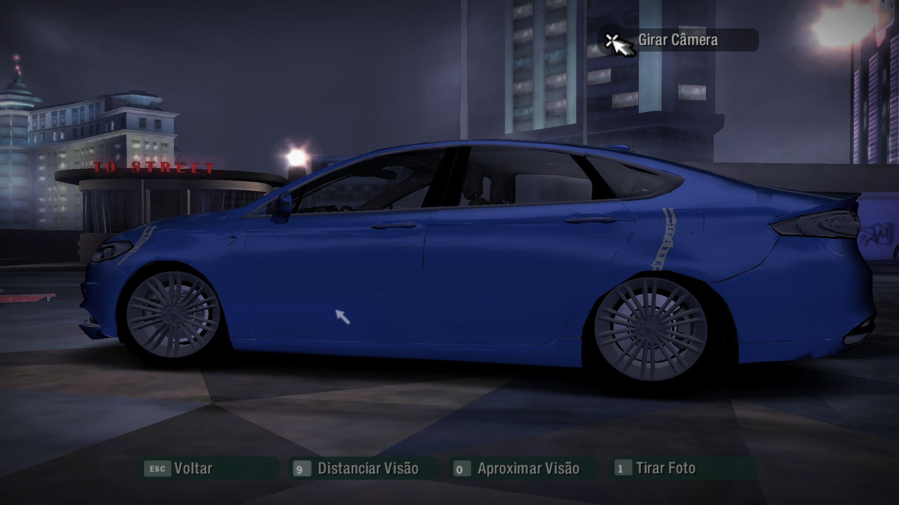
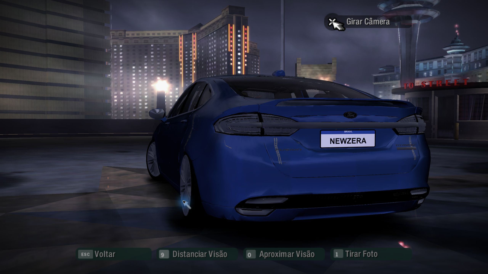
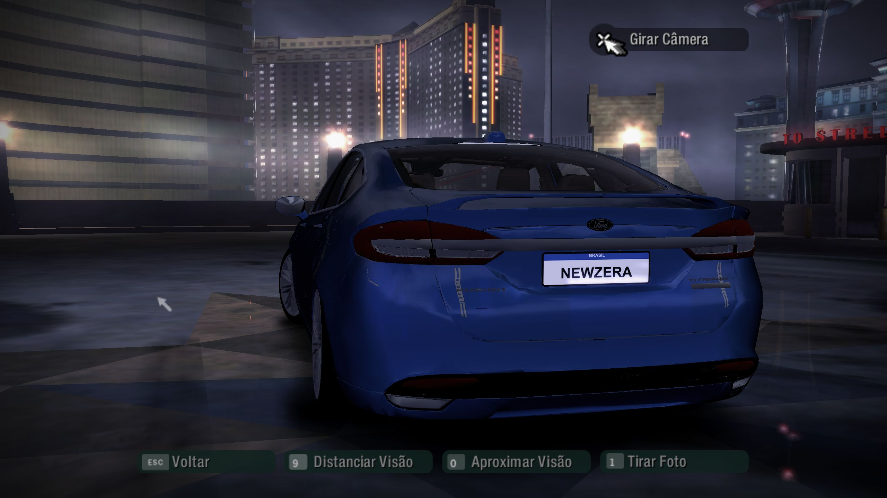
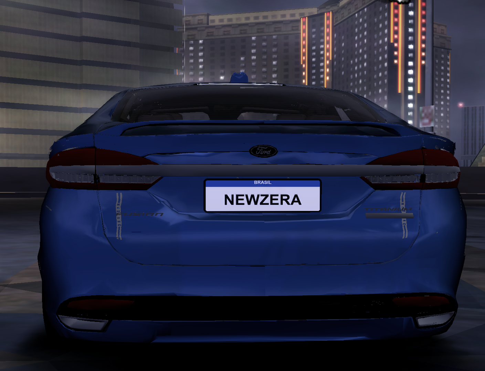

# Ford Fusion — Need for Speed Carbon

> **Release v1.1 (07/10/2026):** Fusion 2018 no lugar do Ford Mustang GT.
> Visual, luzes, aerofólios e entrada de ar do teto aprovados no jogo; nome,
> logotipo e performance ainda são os do Mustang GT. O Fusion 2012 ainda não foi
> portado.

## Downloads — v1.1

| Pacote | Carro | Estado |
| --- | --- | --- |
| [`Fusion2018_AWD_NFSC.zip`](https://github.com/nillander/Ford-Fusion-Titanium-CARBON/releases/download/v1.1/Fusion2018_AWD_NFSC.zip) | Ford Fusion Titanium 2018 (slot MUSTANGGT) | visual, luzes, aerofólios e teto; sem nome/performance próprios |

Notas: [release v1.1](https://github.com/nillander/Ford-Fusion-Titanium-CARBON/releases/tag/v1.1)
· [`release/notes-v1.1.md`](release/notes-v1.1.md). Baixe o ZIP na release v1.1,
extraia e execute `instalar.bat` com o jogo fechado.

| Arquivo publicado | SHA-256 |
| --- | --- |
| `CARS/MUSTANGGT/GEOMETRY.BIN` | `DE8EE10F8DDA430076D15CAD4DA796398B5BC85DC2EC9D33B4B6B1F94967680E` |
| `CARS/MUSTANGGT/TEXTURES.BIN` | `8989A7E4502F92B2D2828E817AD8B7F3ACB0D46A4227B6275CA013EA3651E3AC` |

O pacote é gerado por `python scripts/package_release.py v1.1 local/release-v1.1`
a partir dos BIN aprovados (fora do Git, em `work/`). Instalador, LEIA-ME e créditos
ficam em `release/pacote/`.

Port dos Fusion 2012 FWD e 2018 da release MW2005 v2.8, por substituição de slots.

| Fusion | Fonte MW | Slot/doador oficial Carbon |
| --- | --- | --- |
| 2012 FWD | COBALTSS | CAMARO (não CAMARON) |
| 2018, nome AWD | MUSTANGGT | MUSTANGGT |

Use os veículos oficiais **que serão substituídos** como doadores de estrutura,
peças de compatibilidade, materiais e pontos de montagem do Carbon. A malha visual
Fusion vem dos ZIPs MW; não usar outro mod como doador Carbon. A tração do 2018
na v2.8 MW é RWD; AWD real continua sendo uma decisão pendente.

## Ambiente e reprodução

- Projeto MW: `C:\Users\nillander\NoDocuments\fusion-mw2005`
- Carbon: `D:\Program Files (x86)\Electronic Arts\Need for Speed Carbon`
- Executar na raiz: `pwsh -File scripts/prepare-reference.ps1`
- Depois: `python scripts/inventory_geometry.py`

O setup verifica os SHA-256 dos ZIPs v2.8 antes de extrair, preserva os BIN dos
doadores e todos os arquivos diretamente em GLOBAL. Não altera a instalação.
As cópias de Carbon são preservadas: se o jogo mudar, o setup recusa sobrescrevê-las.
Os ZIPs contêm uma pasta raiz, portanto a extração tem dois níveis com o nome do pacote.

`docs/reference-manifest.json` registra origem, tamanho e hash dos 73 arquivos.
`docs/geometry-inventory.json` registra catálogos e os cabeçalhos legíveis.
BIN proprietários, ferramentas de terceiros e arquivos temporários ficam fora do Git.
As pastas `reference/` e `tools/vendor/` existem apenas neste computador e podem ser
recriadas a partir das origens documentadas.

## Estado

Setup e backup feitos. **07/10, manhã:** o Fusion 2018 corrigido foi instalado
experimentalmente no MUSTANGGT e apareceu na visualização do jogo com rodas.
O primeiro carregamento foi confirmado; corrida, kits, materiais e QA completo pendentes.
Os doadores copiados vêm da instalação atual. Claude encontrou datas de build de
2006 compatíveis com carros intocados e conferiu os hashes contra as referências.
Isso sustenta a hipótese de arquivos oficiais, mas **não comprova a origem vanilla**.
O `Backup` existente só contém localização, não carros originais nem GLOBAL limpo.

| Geometria | Catálogo | Cabeçalhos com nome lidos | Entradas comprimidas |
| --- | ---: | ---: | ---: |
| Carbon CAMARO | 848 | 848 | 848 |
| Carbon MUSTANGGT | 997 | 997 | 997 |
| MW Fusion 2012 | 202 | 202 | 0 |
| MW Fusion 2018 | 186 | 186 | 0 |

O inventário registra cabeçalhos/hashes. `docs/carbon-mesh-audit.json` registra a
leitura independente das 1845 malhas descomprimidas, incluindo 269 com morph targets.
O mapa inicial MUSTANGGT está em `docs/mustanggt-part-map.csv`: 86 nomes coincidem
com o Fusion MW, mas isso ainda não comprova compatibilidade com o slot.

O Fusion 2018 foi compilado com ModTools e reexportado pelo CarToolkit 3.1 para
`work/carbon2018-stage/`: 186 sólidos e 10 texturas Carbon passaram nos leitores
independentes. Treze malhas excediam 65535 índices e foram simplificadas somente
em staging. Relatórios: `docs/carbon2018-simplification.json`,
`docs/carbon2018-stage-audit.json` e `docs/carbon2018-texture-audit.json`.

Essa saída precisa de adaptação aos pontos de montagem, kits, AutoSculpt, damage,
materiais e cores do doador oficial antes de instalar. OBJ não preserva cores de
vértices; as bordas da simplificação exigem QA visual. A primeira observação em jogo
da saída corrigida está registrada abaixo; o QA completo continua pendente.
`mwgc` e `RetargetSlot` continuam sendo ferramentas MW, sem conversão para Carbon.

**07/10, manhã:** `work/carbon2018-stage-axes` foi recompilado, com orientação
correta e 165 marcadores auditados. O staging antigo `work/carbon2018-stage`
continua obsoleto, girado e sem montagem. Diagnóstico original:
[docs/SESSAO-CLAUDE-2026-10-07.md](docs/SESSAO-CLAUDE-2026-10-07.md).
Passagem anterior: [docs/CONTINUACAO-CLAUDE.md](docs/CONTINUACAO-CLAUDE.md).

## Aprendizados da construção

### Converter formato e preservar o slot são etapas distintas

A primeira entrega foi uma referência reproduzível: ZIPs MW v2.8 conferidos,
backup dos dois slots e GLOBAL, e manifesto de 73 arquivos. Renomear XNAME ou
copiar um BIN MW não converte a geometria para Carbon; o pacote MW também usa
Mod Loader/MWPS, enquanto FE e performance do Carbon precisam de edição VLT.

O doador continua sendo o carro oficial substituído. Os 186 sólidos Fusion 2018
coincidem com apenas 86 nomes dos 997 sólidos MUSTANGGT. Os outros 911 nomes não
equivalem a 911 peças obrigatórias: é preciso identificar os kits, LODs, damage,
AutoSculpt e peças usados pelo slot. Dos 1845 sólidos dos doadores instalados,
269 têm morph targets; recompilar apenas a carroceria não preserva esses recursos.

### CIP precisa respeitar o destino de cada bloco

Os doadores Carbon usam streaming comprimido. Cada bloco CIP tem cabeçalho de
24 bytes com tamanho descomprimido, tamanho comprimido e offset de destino.
Blocos de sólidos grandes podem aparecer fora de ordem: concatená-los corrompe
a malha. O extrator verifica limites, cobertura sem sobreposição/lacunas, tamanho
final e hash do sólido. HUFF declara tamanho de payload sem os 16 bytes do blob;
JDLZ declara tamanho total. QuickBMS decodifica HUFF e o leitor local trata JDLZ.

### O limite que interrompeu a compilação era de índices

`Indices count for MUSTANGGT_BASE_A exceeded 65536` apareceu nos dois exportadores.
Conferir apenas o número de vértices não bastava: 13 malhas ultrapassavam 65535
índices. A redução ocorreu só nas cópias de trabalho, por material, com
meshoptimizer 1.3.0; o máximo final foi **65397 índices** por sólido.

Foram mantidos os vértices, normais e UVs selecionados da fonte, alterando a
conectividade das faces. Pesos: normais 0.1, UVs 1; erro alvo 0.01, flags
`Sparse` e `Permissive`. O maior erro relativo ponderado foi cerca de 0.001241;
esse valor não é distância em metros. `LockBorder` impedia atingir o limite e
não foi usado. Costuras, silhueta e UVs ainda precisam de revisão visual.

### Compilação bem-sucedida exige conferência independente

O nfscgc compilou todos os OBJ, mas produziu uma entrada vazia com hash zero e
contagens de vértices de materiais incompatíveis com o leitor independente.
O CarToolkit abriu a saída bruta, reconheceu os 186 sólidos reais e reexportou
para Carbon, sem a entrada vazia. Essa saída passou na leitura das malhas.

Os nomes e as contagens de triângulos dos 186 sólidos correspondem à entrada
esperada; os hashes das 10 texturas correspondem ao remapeamento. Esses resultados
certificam os aspectos estruturais verificados, e não a montagem ou o visual em jogo.
O staging bruto `work/carbon-compiler/geometry.bin` não deve ser instalado.

### Uma auditoria de índices não detecta um carro girado

Claude comparou as caixas delimitadoras com o doador: o nfscgc transforma
`(x, y, z)` em `(y, −x, z)`. A primeira saída ficou girada 90° no eixo Z.
`scripts/prepare-compiler-input.py` prepara posições e normais com a transformação
inversa `(−y, x, z)`, sem espelhamento ou mudança do enrolamento das faces.
Os OBJ corrigidos estão em `work/carbon2018-source-axes`; a saída corrigida
foi compilada e auditada em `work/carbon2018-stage-axes`. A galeria histórica de
ferramenta abaixo é anterior à correção.

### Pontos de montagem também fazem parte da conversão

A primeira exportação não tinha marcadores. Foram extraídos 296 do MUSTANGGT,
276 do CAMARO e os marcadores MW dos dois Fusion. No doador Carbon, LEFT fica
em +Y; parte dos marcadores MW usa o lado oposto. O gerador normaliza os lados
e prepara 165 OBJ de pontos, com anexos às peças correspondentes do doador.

As 165 posições foram conferidas dentro de 1 mm na saída compilada. As matrizes
do exemplo divergiam das do doador em faróis, freios e spoilers; o novo script
`scripts/apply-donor-marker-matrices.py` preserva as matrizes do MUSTANGGT e as
translações Fusion. Quando falta a mesma peça/LOD no doador, usa a família oficial
BASE_A, KIT00_BODY_A ou KIT00_FRONT_TIRE_A, registrando a origem de cada matriz.
CarToolkit reexportou essa saída e a auditoria confirmou os 165 registros. Continuam
pendentes LICENSEPLATE, ROOF_SCOOP, escapes de para-choques e hashes do teto.
As rotações do exemplo do autor são referência do formato da ferramenta;
o veículo do exemplo não é doador deste port.

### Texturas e atributos não podem ser certificados só pelo nome

As luzes foram renomeadas para `MUSTANGGT_BRAKE_OFF` e `MUSTANGGT_HEAD_OFF`,
seguindo naquele teste o limite de 23 caracteres do pipeline MW. Esse limite
não vale como regra geral para o CarToolkit/Carbon: o doador oficial tem nomes
de luzes maiores, que precisam manter os hashes completos. As 10 texturas
Carbon passaram na descompressão,
conferência de hashes, dimensões, formatos DXT e dados dos mipmaps declarados.
A fonte tem apenas um nível de mipmap: isso não certifica qualidade à distância.
BADGING e SKIN19 ainda usam DXT3 e precisam de revisão de alpha/opacidade.

OBJ não preserva as cores de vértices do BIN MW. Effects/materiais Carbon e
20 hashes de texturas compartilhadas também precisam ser conferidos no GLOBAL.
Uma prévia com superfícies transparentes ou adesivos provisórios não é resultado final.

### VLT e mods existentes mudam o alcance dos testes

O leitor somente-leitura `scripts/vlt_dump.py` encontrou coleções e herança;
ele ainda não lê valores de campo. Não foram encontrados nós `_top`.
`frontend/mustanggt` herda de Ford; `frontend/camaro`, de Chevrolet, e precisa
da alteração de fabricante. MustangGT não tem coleções próprias de induction/nos.

`pvehicle/camaron` herda de `pvehicle/camaro`: alterar campos herdados pode atingir
o Camaro Concept. A transmissão tem coleção própria, mas valores efetivos precisam
ser conferidos no VltEd antes de aplicar FWD. O nome AWD do Fusion 2018 não prova
a tração: a fonte MW usa RWD, e a decisão Carbon continua pendente.

A instalação já contém NFSCUnlimiter, ExtraOptions, WidescreenFix e DLC Unlocker.
Registrar esse ambiente no QA. A carreira com CAMARO, IA, garagem, luzes, damage,
vinis e dirigibilidade ainda não foram testados neste port. Apenas o primeiro
carregamento visual do Fusion 2018 foi confirmado nesta manhã.

## Prévias preservadas da sessão

Capturas originais recuperadas do histórico Codex de 07/10/2026, sem edição.
São prévias de ferramenta, não imagens de um port instalado. Origem, horários
locais e SHA-256 estão em [docs/previas/manifesto.json](docs/previas/manifesto.json).

**01:52 — fonte MW v2.8 aberta no CarToolkit.** Vista frontal usada para inspecionar
a geometria de origem; o catálogo contém 186 sólidos.


**02:00 — compilação Carbon preliminar aberta no CarToolkit.** Vista lateral da
saída bruta: materiais e montagem ainda pendentes, sem rodas montadas e anterior
à correção da rotação. A imagem registra problemas da etapa, não aprovação visual.


<details>
<summary>Registros da exportação Carbon de geometria e texturas</summary>

Reexportação da geometria com alvo Carbon e modo config-free:


Exportação das texturas com os dois nomes de luzes encurtados:


</details>

## Retomada e critérios para avançar

Orientação, limites, 165 posições/matrizes e texturas passaram na auditoria em
`docs/carbon2018-stage-axes-verification.json`. A instalação experimental está
ativa em `CARS/MUSTANGGT`; o backup da pasta inteira foi conferido contra as
referências, e VINYLS/VLT/FE ficaram intactos. O nome no jogo continua Mustang GT.



**Primeiro teste em jogo, 07/10 por volta de 10:02.** Carroceria e rodas carregaram,
com a orientação correta. Há artefatos visíveis nas superfícies, vidros e adesivos;
a imagem não aprova acabamento, kits ou dirigibilidade. A seleção/câmera foi
operada pelo usuário após abrir o jogo; Codex observou e preservou a captura.

Para restaurar os BIN originais, fechar o jogo e executar na raiz:

```powershell
pwsh -NoProfile -File scripts/test-install-2018.ps1 -Action Restore
```

Após confirmação do usuário de que o 2018 apareceu, a comparação identificou
uma perda do OBJ: a saída tinha cor de vértice `FFFFFFFF` em todos os vértices,
enquanto a fonte contém cores diferentes nos adesivos e freios. Recuperamos 552
valores em 14 sólidos por correspondência de posição/UV, recusando correspondências
ambíguas. O CarToolkit preservou byte a byte os sólidos corrigidos; as malhas,
materiais, marcadores e texturas permaneceram iguais. A nova versão passou na leitura
independente dos 186 sólidos e está instalada em `work/carbon2018-stage-colors`.

**Aprendizado:** a correção dos atributos não eliminou as faixas e os pequenos
artefatos vistos na segunda observação. Ainda precisamos verificar a compatibilidade
dos oito hashes de adesivos compartilhados sem nome, os materiais e a simplificação.
O comparativo de triângulos da fonte não encontrou sobreposição exata entre
BASE/BODY/HOOD; isso não exclui superfícies próximas ou sobreposição após simplificar.
Normais/tangentes também têm diferenças em relação ao doador, sem causa visual
estabelecida. O usuário encerrou Computer Use com Esc; não houve teste de corrida.

Para repetir **a versão com cores recuperadas**, fechar o jogo e executar:

```powershell
pwsh -NoProfile -File scripts/test-install-2018.ps1 -Action Install -VerificationFile docs/carbon2018-stage-colors-verification.json
```

`-Action Install` sem o parâmetro reaplica a comparação anterior `stage-axes`. Registro em
`docs/carbon2018-test-install.json`. Próxima etapa: investigar os artefatos visuais
e lacunas de peças, testar corrida/garagem e depois preparar VLT. Fusion 2012,
QA completo e release continuam pendentes. Detalhes da execução em
[docs/SESSAO-CODEX-2026-10-07.md](docs/SESSAO-CODEX-2026-10-07.md).

**Revisão do usuário e teste de lentes — 10:28:** a carroceria foi considerada boa,
sem outras deformações percebidas. As faltas relatadas são as lentes vermelhas e
brancas das lanternas, refletores vermelhos acima dos escapamentos, faróis e
faróis de milha. Também há adesivos “Mustang” deslocados. Esse relato refina a
interpretação anterior da captura: não considerar as marcas prova de deformação.

As malhas GLASS existem. A conversão deixou suas configurações em `0x4180`, enquanto
as lentes do doador oficial usam `0x14180`. `prepare-carbon-lenses.py` recupera as
configurações de material e shader do doador para os oito sólidos de lentes; usa
o LOD A da mesma família quando o doador não contém aquele LOD. Também oculta as
26 superfícies DECAL herdadas por índices degenerados, preservando seus nomes no
catálogo. Não remove emblemas/badging. Essa técnica retira a superfície de adesivo
original e também suspende sua personalização até uma adaptação futura.

O staging **atualmente instalado** é `work/carbon2018-stage-lenses`. Auditoria de
186 sólidos e comparação dos bytes confirmaram 152 sólidos intactos, inclusive a
carroceria, e texturas intactas. CarToolkit normalizou o flag de cabeçalho `0x40`
para zero; os flags dos materiais sobreviveram. VINYLS/VLT/FE continuam intactos.
Ainda não foi confirmado visualmente que todas as lentes apareceram ou que as
faixas sumiram: o usuário interrompeu Computer Use com Esc antes da observação.

```powershell
pwsh -NoProfile -File scripts/test-install-2018.ps1 -Action Install -VerificationFile docs/carbon2018-stage-lenses-verification.json
```

Se as faixas persistirem, investigar o vinil aplicado à pintura/save: ocultar
DECAL não remove vinil de carroceria. Leitura do VINYLS oficial encontrou dois
atlases DEBUG/MASK; não alterados neste teste.

[TODO.md](TODO.md) contém o acompanhamento por fase. A sessão Claude de 07/10
complementa a passagem das 02:31 e deve ser lida antes de continuar.

Próxima sessão do Codex: [docs/CONTINUACAO-CODEX.md](docs/CONTINUACAO-CODEX.md).

### Lentes: comparações e aprendizados recuperados do MW

Integrar as lentes aos oito sólidos principais de faróis/lanternas preservou
170 outros sólidos, incluindo a carroceria e os pontos de montagem. O compiler
preencheu `NumVerts` com o número de triângulos nos grupos de OBJ multimaterial;
o ajuste calcula as faixas contíguas de vértices pelos índices e confere o buffer
real de 48 bytes por vértice antes de exportar. A auditoria independente aprovou
186 sólidos. A aparência cinza das lanternas continuou no jogo.

O exportador inicial encurtava nomes como `MUSTANGGT_KIT00_BRAKELIGHT_OFF`.
O doador oficial do Carbon contém esses nomes longos e hashes completos.
A comparação `stage-lighttextures` adicionou oito aliases OFF/ON/GLASS, totalizando
18 texturas. Todos os hashes e pixels DDS foram conferidos após descompressão.
Isso também não eliminou as lanternas cinza. Os aliases ON ainda copiam os pixels
OFF: não representam luzes acesas finalizadas.

A pedido do usuário, foram relidos o [README do MW](../fusion-mw2005/README.md)
e seus [aprendizados](../fusion-mw2005/docs/APRENDIZADOS.md), especialmente as
seções 1, 16 e 18. Eles registram três diagnósticos diferentes: DXT3 em peças
opacas prejudicava a profundidade; a UV do farol caía em região preta do atlas;
e a lente traseira aprovada precisava conservar sua cobertura e usar o material
difuso `DULLPLASTIC` (`0FEDEE40`). Nenhum deles deve ser transferido ao Carbon
como causa confirmada sem comparação no jogo.

`stage-opaque-brake` testa somente DXT3→DXT1 em cinco atlases traseiros.
Os blocos RGB foram preservados sem recompressão; a leitura dos DDS confirma
cada pixel RGB idêntico. Geometria e outras 13 texturas permanecem iguais.
**Resultado observado: as lanternas continuam cinza e as faixas Mustang persistem.**
A comparação seguinte, `stage-diffuse-brake`, restaurou o material difuso das quatro
lentes traseiras integradas, usando o mesmo hash encontrado no MUSTANGGT oficial.
Só o material e uma flag por lente mudaram; os outros 182 sólidos e o TPK ficaram
iguais. Exportada, auditada e instalada às 11:01: as lanternas continuaram cinza.



Auditorias: `docs/carbon2018-stage-integrated-verification.json`,
`docs/carbon2018-stage-lighttextures-verification.json` e
`docs/carbon2018-stage-opaque-brake-verification.json`. A validação estrutural
não aprova o acabamento. Lentes, refletores, faróis, milha, iluminação em corrida
e vinil de fábrica continuam pendentes.

### Slots dinâmicos: primeira melhora das lanternas no jogo

A pesquisa encontrou a explicação de AJ_Lethal: nomes como `BRAKELIGHT_RIGHT`
representam referências para troca dinâmica, usadas no material da geometria.
O autor das ferramentas também lista os atlas completos OFF/ON/GLASS do Carbon.
Fontes: [relato no fórum CarToolkit](https://www.nfsaddons.com/forums/index.php?topic=2412.0)
e [documentação de texturas de nfsu360](https://nfs-tools.blogspot.com/2010/01/nfsu2mw-texture-compiler-usage.html).
O exemplo Bugatti fornecido com Carbon ModTools e o `ViewerMappings.txt` do
CarToolkit usam esses vínculos. O MUSTANGGT oficial confirmou os hashes:
`HEADLIGHT_RIGHT = F68EF19F`, `BRAKELIGHT_RIGHT = 02B52399`.

`stage-dynamic-lights` troca somente oito hashes de referência nos sólidos
principais A–D. Não muda UV, posição, índices, shaders, flags nem DDS em relação
à comparação difusa. Auditoria byte a byte aprovada; instalado às 11:06.
**Resultado observado: o vermelho apareceu nas lentes traseiras e nos refletores
acima dos escapes.** Isso identifica um problema no vínculo direto das texturas
neste port. Não prova que a compressão ou o material anteriores eram ideais:
as comparações seguintes devem avaliar esses pontos separadamente.



O miolo branco ainda mostra elementos cinza, e as faixas Mustang persistem.
Faróis, milha, transparência, estados acesos e kits ainda precisam de QA.
O usuário confirmou que as lentes apareceram e solicitou encerrar o aprendizado
para o Claude continuar. A confirmação vale para o aparecimento observado;
o acabamento completo e a release continuam pendentes.



O doador do port continua sendo o MUSTANGGT oficial; o Bugatti serviu apenas
como documentação das ferramentas. A auditoria atual está em
`docs/carbon2018-stage-dynamic-lights-verification.json`.

### Entrada de ar do teto e diagnóstico dos travamentos — 07/10

A fonte completa foi recompilada no nfscgc com quatro peças mínimas
`KIT00_ROOF_A..D`, cada uma com `ROOF_SCOOP`. O ponto segue a peça correspondente
do MUSTANGGT oficial, adaptado ao Fusion: `(0,10; 0; 1,23757)` e inclinação de
5,35°. A exigência de anexar o marcador à peça ROOF também é descrita por um
modder em [relato de Carbon](https://www.nfsaddons.com/forums/index.php?topic=2715.0).
As 186 peças da v1.0 foram preservadas integralmente após descompressão, incluindo
lentes, cores, marcadores e aerofólios. O leitor independente passou nas 190 malhas.

O primeiro teste dessa recompilação também fechou o jogo. A análise dos seis dumps
locais mostrou falhas na rotina JDLZ (`0x69C650`, `0x69C673`, `0x69C6E4`). O código
do executável recarrega flags no fim do último grupo antes de verificar o tamanho
comprimido; o compressor Python removia esses bytes finais. O leitor LibNFS/Python
parava ao completar a saída e ocultava o erro. Portanto, as conclusões anteriores
de que adicionar peças ou aumentar o arquivo necessariamente causa crash não
foram isoladas pelos testes.

`scripts/jdlz.py` preserva agora as flags terminais. `normalize_for_game` verifica
esse comportamento e corrige somente o fim do stream, com comparação exata da
saída. Nos 186 arquivos do cache, 49 faltavam flags finais (51 bytes ao todo).
Regressões cobrem ambos os compressores, limites de grupos e repetição, além de
dois streams que o leitor antigo aceitava e o Carbon não conseguia encerrar.

O novo teste está em `work/carbon2018-stage-roof` e sua auditoria em
`docs/carbon2018-stage-roof-verification.json`: 31.841.920 bytes, menor que a v1.0,
texturas idênticas e 186 peças existentes idênticas após descompressão.
**O usuário confirmou: “teto resolvido”; o Fusion carregou e as entradas de ar
apareceram**, após conferir as opções comum e AutoSculpt. Publicado na **v1.1**.
