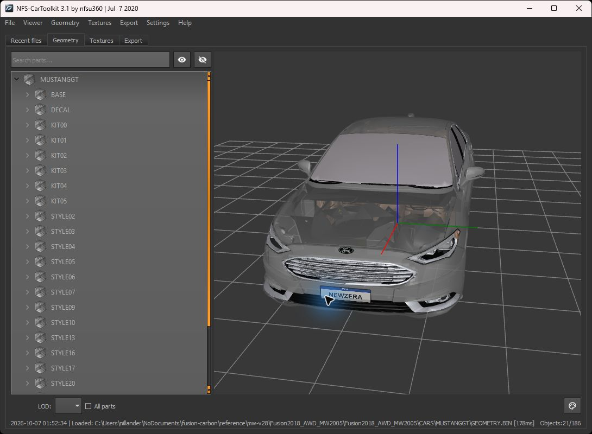
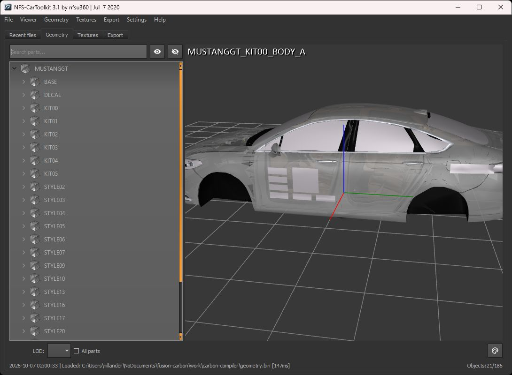
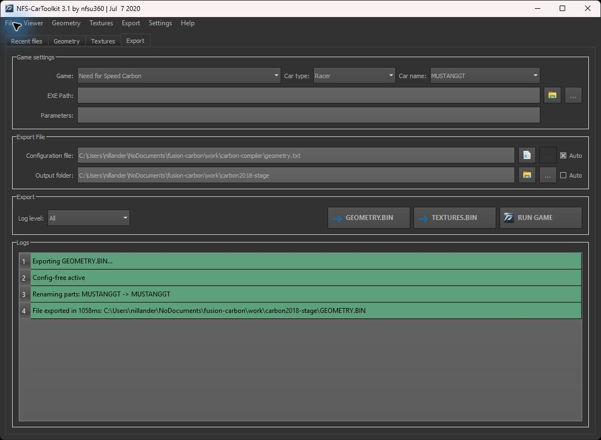
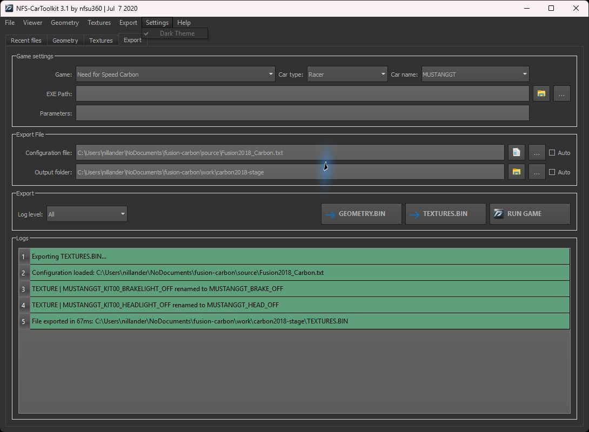

# Ford Fusion — Need for Speed Carbon

Port dos Fusion 2012 FWD e 2018 da release MW2005 v2.8, por substituição de slots.

| Fusion | Fonte MW | Slot/doador oficial Carbon |
| --- | --- | --- |
| 2012 FWD | COBALTSS | CAMARO (não CAMARON) |
| 2018, nome AWD | MUSTANGGT | MUSTANGGT |

Use os veículos oficiais **que serão substituídos** como doadores de estrutura,
peças de compatibilidade, materiais e pontos de montagem do Carbon. A malha visual
Fusion vem dos ZIPs MW; não usar outro mod como doador Carbon. A tração do 2018
na v2.8 MW é RWD; AWD real continua sendo uma decisão pendente.

## Ambiente e reprodução

- Projeto MW: `C:\Users\nillander\NoDocuments\fusion-mw2005`
- Carbon: `D:\Program Files (x86)\Electronic Arts\Need for Speed Carbon`
- Executar na raiz: `pwsh -File scripts/prepare-reference.ps1`
- Depois: `python scripts/inventory_geometry.py`

O setup verifica os SHA-256 dos ZIPs v2.8 antes de extrair, preserva os BIN dos
doadores e todos os arquivos diretamente em GLOBAL. Não altera a instalação.
As cópias de Carbon são preservadas: se o jogo mudar, o setup recusa sobrescrevê-las.
Os ZIPs contêm uma pasta raiz, portanto a extração tem dois níveis com o nome do pacote.

`docs/reference-manifest.json` registra origem, tamanho e hash dos 73 arquivos.
`docs/geometry-inventory.json` registra catálogos e os cabeçalhos legíveis.
BIN proprietários, ferramentas de terceiros e arquivos temporários ficam fora do Git.
As pastas `reference/` e `tools/vendor/` existem apenas neste computador e podem ser
recriadas a partir das origens documentadas.

## Estado

Setup e backup feitos; nenhum port foi instalado ou testado no Carbon.
Os doadores copiados vêm da instalação atual. Claude encontrou datas de build de
2006 compatíveis com carros intocados e conferiu os hashes contra as referências.
Isso sustenta a hipótese de arquivos oficiais, mas **não comprova a origem vanilla**.
O `Backup` existente só contém localização, não carros originais nem GLOBAL limpo.

| Geometria | Catálogo | Cabeçalhos com nome lidos | Entradas comprimidas |
| --- | ---: | ---: | ---: |
| Carbon CAMARO | 848 | 848 | 848 |
| Carbon MUSTANGGT | 997 | 997 | 997 |
| MW Fusion 2012 | 202 | 202 | 0 |
| MW Fusion 2018 | 186 | 186 | 0 |

O inventário registra cabeçalhos/hashes. `docs/carbon-mesh-audit.json` registra a
leitura independente das 1845 malhas descomprimidas, incluindo 269 com morph targets.
O mapa inicial MUSTANGGT está em `docs/mustanggt-part-map.csv`: 86 nomes coincidem
com o Fusion MW, mas isso ainda não comprova compatibilidade com o slot.

O Fusion 2018 foi compilado com ModTools e reexportado pelo CarToolkit 3.1 para
`work/carbon2018-stage/`: 186 sólidos e 10 texturas Carbon passaram nos leitores
independentes. Treze malhas excediam 65535 índices e foram simplificadas somente
em staging. Relatórios: `docs/carbon2018-simplification.json`,
`docs/carbon2018-stage-audit.json` e `docs/carbon2018-texture-audit.json`.

Essa saída precisa de adaptação aos pontos de montagem, kits, AutoSculpt, damage,
materiais e cores do doador oficial antes de instalar. OBJ não preserva cores de
vértices; as bordas da simplificação exigem QA visual. Nenhum teste em jogo foi feito.
`mwgc` e `RetargetSlot` continuam sendo ferramentas MW, sem conversão para Carbon.

**07/10:** o staging 2018 está girado 90° (orientação do nfscgc) e sem pontos de montagem;
não instalar. Correção pronta para recompilar: [docs/SESSAO-CLAUDE-2026-10-07.md](docs/SESSAO-CLAUDE-2026-10-07.md).
Passagem anterior: [docs/CONTINUACAO-CLAUDE.md](docs/CONTINUACAO-CLAUDE.md).

## Aprendizados da construção

### Converter formato e preservar o slot são etapas distintas

A primeira entrega foi uma referência reproduzível: ZIPs MW v2.8 conferidos,
backup dos dois slots e GLOBAL, e manifesto de 73 arquivos. Renomear XNAME ou
copiar um BIN MW não converte a geometria para Carbon; o pacote MW também usa
Mod Loader/MWPS, enquanto FE e performance do Carbon precisam de edição VLT.

O doador continua sendo o carro oficial substituído. Os 186 sólidos Fusion 2018
coincidem com apenas 86 nomes dos 997 sólidos MUSTANGGT. Os outros 911 nomes não
equivalem a 911 peças obrigatórias: é preciso identificar os kits, LODs, damage,
AutoSculpt e peças usados pelo slot. Dos 1845 sólidos dos doadores instalados,
269 têm morph targets; recompilar apenas a carroceria não preserva esses recursos.

### CIP precisa respeitar o destino de cada bloco

Os doadores Carbon usam streaming comprimido. Cada bloco CIP tem cabeçalho de
24 bytes com tamanho descomprimido, tamanho comprimido e offset de destino.
Blocos de sólidos grandes podem aparecer fora de ordem: concatená-los corrompe
a malha. O extrator verifica limites, cobertura sem sobreposição/lacunas, tamanho
final e hash do sólido. HUFF declara tamanho de payload sem os 16 bytes do blob;
JDLZ declara tamanho total. QuickBMS decodifica HUFF e o leitor local trata JDLZ.

### O limite que interrompeu a compilação era de índices

`Indices count for MUSTANGGT_BASE_A exceeded 65536` apareceu nos dois exportadores.
Conferir apenas o número de vértices não bastava: 13 malhas ultrapassavam 65535
índices. A redução ocorreu só nas cópias de trabalho, por material, com
meshoptimizer 1.3.0; o máximo final foi **65397 índices** por sólido.

Foram mantidos os vértices, normais e UVs selecionados da fonte, alterando a
conectividade das faces. Pesos: normais 0.1, UVs 1; erro alvo 0.01, flags
`Sparse` e `Permissive`. O maior erro relativo ponderado foi cerca de 0.001241;
esse valor não é distância em metros. `LockBorder` impedia atingir o limite e
não foi usado. Costuras, silhueta e UVs ainda precisam de revisão visual.

### Compilação bem-sucedida exige conferência independente

O nfscgc compilou todos os OBJ, mas produziu uma entrada vazia com hash zero e
contagens de vértices de materiais incompatíveis com o leitor independente.
O CarToolkit abriu a saída bruta, reconheceu os 186 sólidos reais e reexportou
para Carbon, sem a entrada vazia. Essa saída passou na leitura das malhas.

Os nomes e as contagens de triângulos dos 186 sólidos correspondem à entrada
esperada; os hashes das 10 texturas correspondem ao remapeamento. Esses resultados
certificam os aspectos estruturais verificados, e não a montagem ou o visual em jogo.
O staging bruto `work/carbon-compiler/geometry.bin` não deve ser instalado.

### Uma auditoria de índices não detecta um carro girado

Claude comparou as caixas delimitadoras com o doador: o nfscgc transforma
`(x, y, z)` em `(y, −x, z)`. A primeira saída ficou girada 90° no eixo Z.
`scripts/prepare-compiler-input.py` prepara posições e normais com a transformação
inversa `(−y, x, z)`, sem espelhamento ou mudança do enrolamento das faces.
Os OBJ corrigidos estão em `work/carbon2018-source-axes`; **a saída corrigida
ainda precisa ser compilada e auditada**. A prévia abaixo é anterior à correção.

### Pontos de montagem também fazem parte da conversão

A primeira exportação não tinha marcadores. Foram extraídos 296 do MUSTANGGT,
276 do CAMARO e os marcadores MW dos dois Fusion. No doador Carbon, LEFT fica
em +Y; parte dos marcadores MW usa o lado oposto. O gerador normaliza os lados
e prepara 165 OBJ de pontos, com anexos às peças correspondentes do doador.

Posições e matrizes ainda precisam ser conferidas na saída compilada. Continuam
pendentes LICENSEPLATE, ROOF_SCOOP, escapes de para-choques e hashes do teto.
As rotações do exemplo do autor são referência do formato da ferramenta;
o veículo do exemplo não é doador deste port.

### Texturas e atributos não podem ser certificados só pelo nome

As luzes foram renomeadas para `MUSTANGGT_BRAKE_OFF` e `MUSTANGGT_HEAD_OFF`,
respeitando os 23 caracteres. As 10 texturas Carbon passaram na descompressão,
conferência de hashes, dimensões, formatos DXT e dados dos mipmaps declarados.
A fonte tem apenas um nível de mipmap: isso não certifica qualidade à distância.
BADGING e SKIN19 ainda usam DXT3 e precisam de revisão de alpha/opacidade.

OBJ não preserva as cores de vértices do BIN MW. Effects/materiais Carbon e
20 hashes de texturas compartilhadas também precisam ser conferidos no GLOBAL.
Uma prévia com superfícies transparentes ou adesivos provisórios não é resultado final.

### VLT e mods existentes mudam o alcance dos testes

O leitor somente-leitura `scripts/vlt_dump.py` encontrou coleções e herança;
ele ainda não lê valores de campo. Não foram encontrados nós `_top`.
`frontend/mustanggt` herda de Ford; `frontend/camaro`, de Chevrolet, e precisa
da alteração de fabricante. MustangGT não tem coleções próprias de induction/nos.

`pvehicle/camaron` herda de `pvehicle/camaro`: alterar campos herdados pode atingir
o Camaro Concept. A transmissão tem coleção própria, mas valores efetivos precisam
ser conferidos no VltEd antes de aplicar FWD. O nome AWD do Fusion 2018 não prova
a tração: a fonte MW usa RWD, e a decisão Carbon continua pendente.

A instalação já contém NFSCUnlimiter, ExtraOptions, WidescreenFix e DLC Unlocker.
Registrar esse ambiente no QA. A carreira com CAMARO, IA, garagem, luzes, damage,
vinis e dirigibilidade ainda não foram testados neste port.

## Prévias preservadas da sessão

Capturas originais recuperadas do histórico Codex de 07/10/2026, sem edição.
São prévias de ferramenta, não imagens de um port instalado. Origem, horários
locais e SHA-256 estão em [docs/previas/manifesto.json](docs/previas/manifesto.json).

**01:52 — fonte MW v2.8 aberta no CarToolkit.** Vista frontal usada para inspecionar
a geometria de origem; o catálogo contém 186 sólidos.

**02:00 — compilação Carbon preliminar aberta no CarToolkit.** Vista lateral da
saída bruta: materiais e montagem ainda pendentes, sem rodas montadas e anterior
à correção da rotação. A imagem registra problemas da etapa, não aprovação visual.

Registros da exportação Carbon de geometria e texturas

Reexportação da geometria com alvo Carbon e modo config-free:

Exportação das texturas com os dois nomes de luzes encurtados:

## Retomada e critérios para avançar

Primeiro recompilar `work/carbon2018-source-axes` para uma pasta separada,
`work/carbon2018-stage-axes`, e conferir orientação, limites, marcadores e matrizes
contra o doador. Depois adaptar os recursos exigidos pelo MUSTANGGT, revisar
materiais/cores/texturas, preparar VLT e testar instalação reversível com backup.
O Fusion 2012 → CAMARO, o QA em jogo e a release continuam pendentes.

[TODO.md](TODO.md) contém o acompanhamento por fase. A sessão Claude de 07/10
complementa a passagem das 02:31 e deve ser lida antes de continuar.
